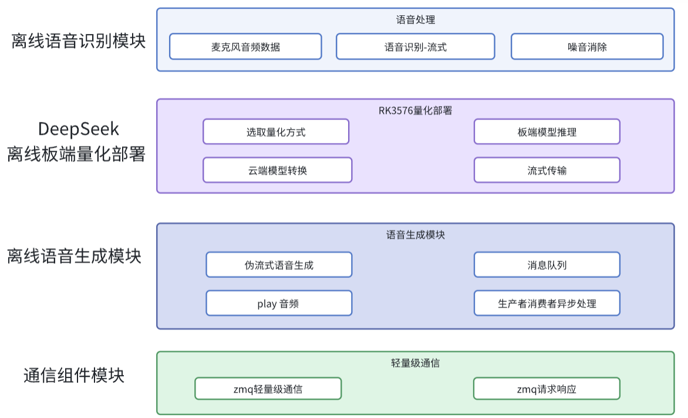

# 端侧部署C++项目-基于DeepSeek与RK3576的模块化离线智能语音交互系统

## 项目视频文档解析
**添加微信**：auto_drive_yue

## 项目概述

本项目开发了一套**全离线、模块化**的智能语音交互系统，基于RK3576 NPU实现端到端智能语音交互流水线，集成**流式ASR、DeepSeek大模型推理、TTS语音合成-双缓冲队列**三大核心模块。系统采用松耦合架构，各模块通过**标准化接口(封装ZeroMQ通信协议)**交互，在嵌入式环境下实现4秒内的**语音输入→LLM思考→语音输出闭环**。

## 项目技术栈
**技术栈**：Linux、C++、ASR、RK芯片云端量化/端侧部署、TTS、ZeroMQ、CMake、多线程

## 项目架构
 

## 核心特性

- 🚀 **全离线部署**：不依赖云端服务，基于RK3576 NPU实现本地化推理
- 🔧 **模块化架构**：ASR/TTS/LLM模块通过ZeroMQ松耦合通信
- ⚡ **低延迟优化**：流式ASR + 双缓冲TTS队列实现快速响应

# 以下是重要补充
# clangd + cmake tools实现代码的阅读、跳转。
## step1 系统环境配置
```sh
# 必需工具 clangd是LSP提供代码智能感知跳转与补全等. build-essential里面有gcc make不包含cmake, 
sudo apt update
sudo apt install -y clangd cmake build-essential 

# 验证安装
clangd --version    # 应显示版本号
cmake --version     # 应显示版本号
gcc --version       # 应显示版本号
```

## step2 项目要求
✅ 有规范的 CMakeLists.txt 文件
✅ 项目能正常编译（至少cmake配置成功）
参考这个连接: https://r3f3348v36.feishu.cn/docx/HuiGdqMw6oo7yrxb68qc6LLUnCc 来实现ASR和TTS模块, 对应代码voicd/与tts/

## step3 vscode/cursor插件安装
### 必装插件
1. CMake Tools (Microsoft)
   插件ID: ms-vscode.cmake-tools
   作用: CMake项目管理和构建

2. clangd (LLVM)  
   插件ID: llvm-vs-code-extensions.vscode-clangd
   作用: 代码智能感知引擎

3. CMake Language Support
   插件ID: twxs.cmake
   作用: CMakeLists.txt语法高亮

### 禁用插件
禁用/卸载: C/C++ (Microsoft)
插件ID: ms-vscode.cpptools
原因: 与clangd冲突，会导致双重解析

## step4 配置文件
### 创建.vscode/setting.json
```json
{
    "clangd.path": "/usr/bin/clangd",
    "clangd.arguments": [
        "--compile-commands-dir=${workspaceFolder}",
        "--header-insertion=never",
        "--clang-tidy",
        "--completion-style=detailed",
        "--function-arg-placeholders=false",
        "--log=info"
    ],
    "clangd.onConfigChanged": "restart",
    "cmake.configureOnOpen": true,
    "cmake.exportCompileCommandsFile": true,
    "cmake.generator": "Unix Makefiles",
    "cmake.parallelJobs": 4,
    "cmake.buildDirectory": "${workspaceFolder}/build",
    "files.associations": {
        "*.h": "cpp",
        "*.cc": "cpp",
        "*.hpp": "cpp"
    },
    "C_Cpp.intelliSenseEngine": "disabled"
}
```
### 创建c_cpp_properties.json
没必要,作用只是当clangd + cmake tools 方案不生效时的代替.

### 更新.gitignore
一般要把build的忽略掉.
.clangd也忽略, 其作用是加速智能感知、跳转、补全。
compile_commands.json 是核心文件. 可以忽略也可以保留.

## 创建自动化配置脚本
```sh
#!/bin/bash
cd /home/kato/work/LLM_Voice_Flow

echo "配置所有CMake模块..."

# 配置zmq-comm-kit
echo "=== 配置 zmq-comm-kit ==="
cd zmq-comm-kit
mkdir -p build && cd build
cmake -DCMAKE_EXPORT_COMPILE_COMMANDS=ON \
      -DCMAKE_C_COMPILER=/usr/bin/gcc \
      -DCMAKE_CXX_COMPILER=/usr/bin/g++ \
      ..
cd ../..

# 配置TTS
echo "=== 配置 TTS ==="
cd tts
mkdir -p build && cd build  
cmake -DCMAKE_EXPORT_COMPILE_COMMANDS=ON \
      -DCMAKE_C_COMPILER=/usr/bin/gcc \
      -DCMAKE_CXX_COMPILER=/usr/bin/g++ \
      ..
cd ../..

# 配置sherpa-onnx
echo "=== 配置 sherpa-onnx ==="
cd voice/sherpa-onnx
mkdir -p build && cd build
cmake -DCMAKE_EXPORT_COMPILE_COMMANDS=ON \
      -DCMAKE_C_COMPILER=/usr/bin/gcc \
      -DCMAKE_CXX_COMPILER=/usr/bin/g++ \
      -DSHERPA_ONNX_ENABLE_PORTAUDIO=ON \
      -DBUILD_SHARED_LIBS=ON \
      ..
cd ../../..

echo "=== 合并compile_commands.json ==="
# 合并所有compile_commands.json
python3 -c "
import json
import os

all_commands = []
files = [
    'zmq-comm-kit/build/compile_commands.json',
    'tts/build/compile_commands.json', 
    'voice/sherpa-onnx/build/compile_commands.json'
]

for file in files:
    if os.path.exists(file):
        print(f'Loading: {file}')
        with open(file) as f:
            all_commands.extend(json.load(f))

with open('compile_commands.json', 'w') as f:
    json.dump(all_commands, f, indent=2)

print(f'Merged {len(all_commands)} compile commands')
"

echo "配置完成！重启VSCode让配置生效。"
```